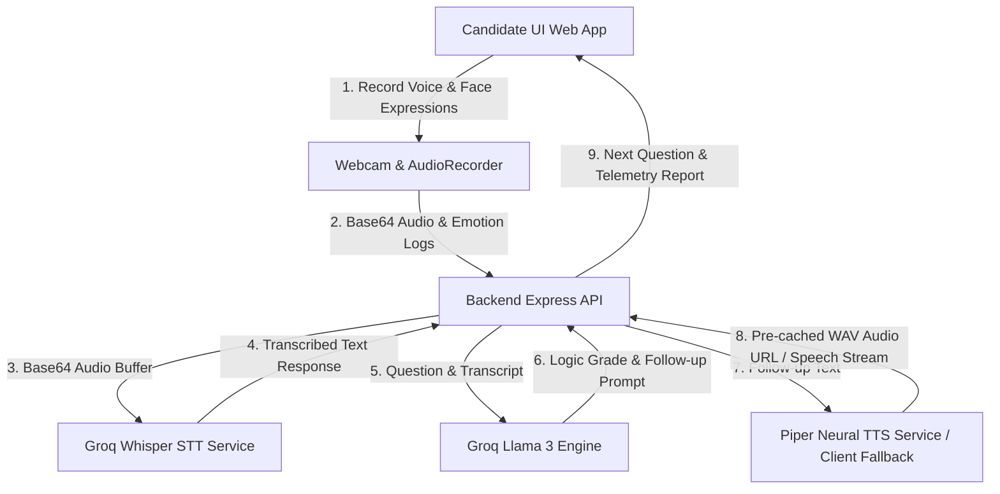

# AI-Powered Live Mock Interview Platform

An advanced, real-time AI-powered interview platform designed to evaluate candidate suitability using conversational artificial intelligence, speech-to-text, neural speech synthesis, and client-side emotion telemetry biometrics.

---

## Key Features

1. **Dynamic Live Interview Engine**: Generates customized conversational follow-up questions in real-time based on candidate answers instead of static predefined lists.
2. **Speech Integration (TTS/STT)**: 
   - **Piper Text-to-Speech (TTS)**: Synthesizes high-fidelity voice output for interviewer questions. Fallback is client-side Web Speech Synthesis if the local neural server is unavailable.
   - **Groq Whisper Speech-to-Text (STT)**: Transcribes candidate voice recordings on the backend using the high-performance `whisper-large-v3` model via the Groq Cloud API.
3. **Face Telemetry Biometrics**: Captures candidate micro-expressions (Neutral, Focused, Happy, Surprised, Nervous) in real-time using client-side `face-api.js` models.
4. **Groq Llama 3 Evaluation Engine**: Employs the `llama-3.1-8b-instant` model on Groq Cloud to critique answers, grade communication and logic correctness, generate follow-up questions, and output comprehensive scoring breakdowns.
5. **Dimensional Reporting Module**: Renders interactive Recharts widgets showing Technical Accuracy, Communication Clarity, and Confidence metrics.
6. **Downloadable PDF Reports**: Built-in `@media print` style overrides format reporting metrics onto clean PDF pages with a single click.

---

## System Architecture



---

## Workflow: Step-by-Step

### 1. Configuration & Start
- The candidate logs in and specifies their **Job Role**, **Experience Level**, **Difficulty Tier**, and **Questions Count** in the dashboard.
- The backend initializes the session and generates the **first question** dynamically using Groq Cloud (`llama-3.1-8b-instant`), triggers background TTS generation via Piper, and updates the status to `in_progress`.

### 2. Live Session Interaction
- **Interviewer Speaks**: The frontend TTS audio component loads the synthesized speech URL and reads the question (falling back to browser Web Speech Synthesis if the neural stream is not setup).
- **Candidate Answers**: The candidate speaks into their microphone. The webcam records face expression indicators every second.
- **Answer Submission**: Once the candidate hits Submit, the audio is converted to Base64 and transmitted with emotion logs.

### 3. Evaluation & Continuation
- **Transcription**: The backend processes the audio buffer using Groq API (`whisper-large-v3`) to get a verbatim text transcript.
- **Critique & Grading**: Groq AI critiques the response (evaluating logic and strengths) and computes a question score.
- **Dynamic Follow-up**:
  - If the session configured limit is not reached, Groq AI generates a conversational follow-up question digging deeper into the candidate's answer.
  - If the limit is reached, Groq AI compiles the final report, updates status to `completed`, and returns a finished state redirecting to the metrics page.

---

## Setup Guide: Step-by-Step

### Prerequisites
- **Node.js**: v18+ installed.
- **PostgreSQL**: Local database server running or a Neon PostgreSQL instance.
- **API Keys**: Access key for Groq Cloud API.

---

### Step 1: Clone and Project Location
Open your terminal in the workspace root directory:
```bash
c:\project folder\DE-project
```

### Step 2: Database Setup
1. Create a PostgreSQL database (e.g. `ai_interviewer` or `neondb`).
2. Navigate to the `backend` folder:
   ```bash
   cd backend
   npm install
   ```
3. Generate schemas and run migrations using Drizzle ORM:
   ```bash
   npm run db:generate
   npm run db:migrate
   ```

### Step 3: Configure Backend Environment
Create a `.env` file in the `backend` directory based on the `.env.example` file:
```env
PORT=5000
NODE_ENV=development

# Database Connection (local PostgreSQL or Neon SSL connection URL)
DATABASE_URL=postgresql://<username>:<password>@localhost:5432/ai_interviewer

# JWT Security Secrets
JWT_SECRET=your_super_secret_access_token_key_12345
JWT_REFRESH_SECRET=your_super_secret_refresh_token_key_67890

# Groq API Key (For Whisper Speech-to-Text & Llama 3 Evaluation)
GROQ_API_KEY=your_groq_api_key_here

# Neural Piper Speech Server (Optional local URL)
PIPER_TTS_URL=http://localhost:5002/api/tts
```

### Step 4: Configure Frontend Environment
Navigate to the `frontend` folder and install dependencies:
```bash
cd ../frontend
npm install
```
Create a `.env` file in the `frontend` directory:
```env
NEXT_PUBLIC_API_URL=http://localhost:5000/api/v1
```

### Step 5: Start the Services

1. **Run Backend Service**:
   ```bash
   cd backend
   npm run dev
   ```
   *The backend will run on [http://localhost:5000](http://localhost:5000).*

2. **Run Frontend Application**:
   ```bash
   cd frontend
   npm run dev
   ```
   *The Next.js client application will start on [http://localhost:3000](http://localhost:3000).*

3. Open your browser and navigate to [http://localhost:3000](http://localhost:3000).

---

## Future Roadmap (Futures List)

- [ ] **Interactive Coding Sandbox**: Add a split-pane coding canvas where candidate algorithms are compiled and evaluated dynamically by Groq AI during technical coding rounds.
- [ ] **Advanced Voice Stress Indicator**: Track candidate vocal dynamics (pitch variation, pause rates, speech tempo) to detect stress markers and supplement confidence biometrics.
- [ ] **Panel Mode Simulations**: Enable candidates to select a panel of multiple AI interviewers with differing behavioral personas (e.g., a friendly PM, a strict Tech Lead, a conversational Recruiter).
- [ ] **Custom Model Fine-Tuning**: Provide companies with the capability to upload their private system documents, codebase patterns, and style guides to generate company-specific technical rounds.
- [ ] **Analytics Enterprise Dashboard**: Enable HR administrators to compare aggregated candidate metrics, filter rating curves, and rank candidates automatically.

